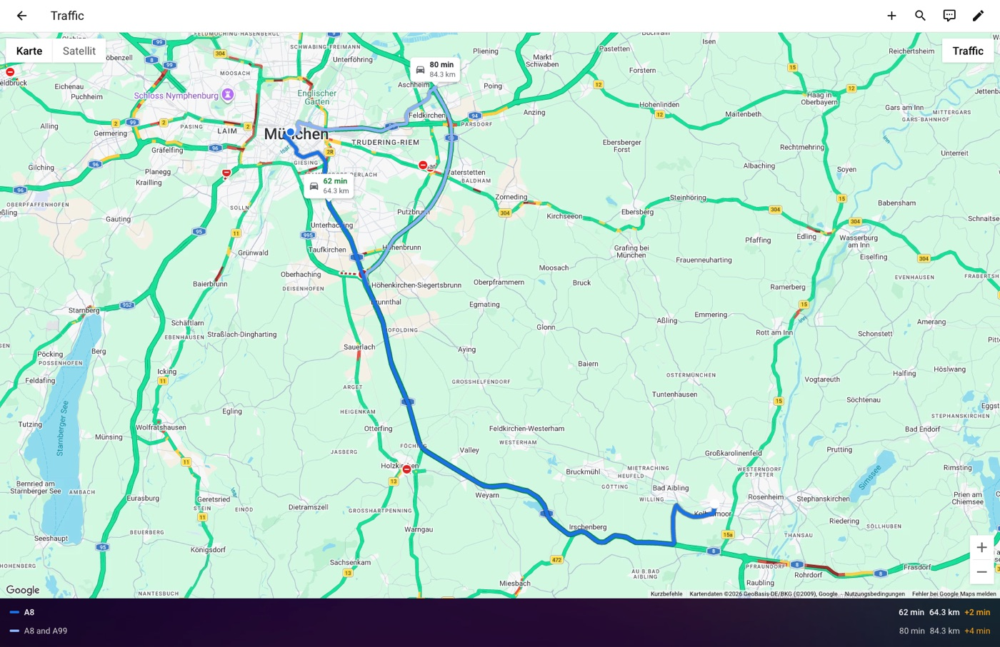
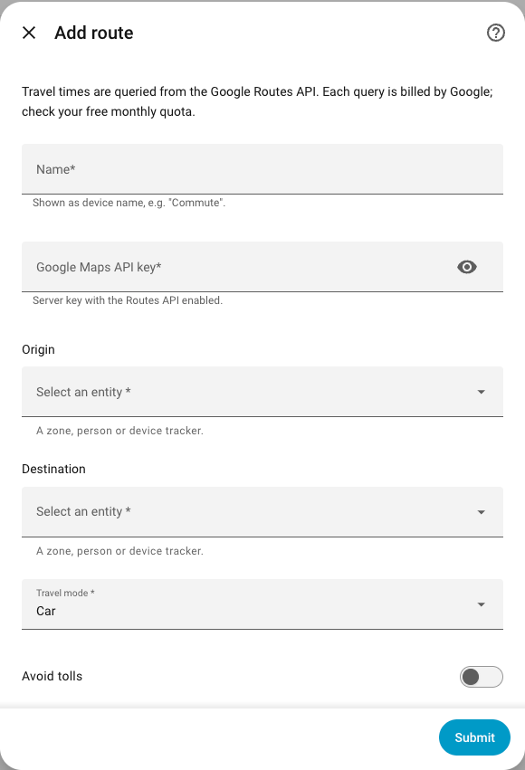
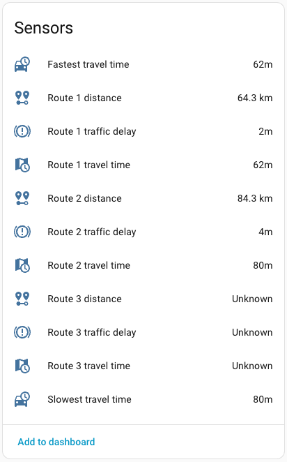
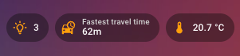
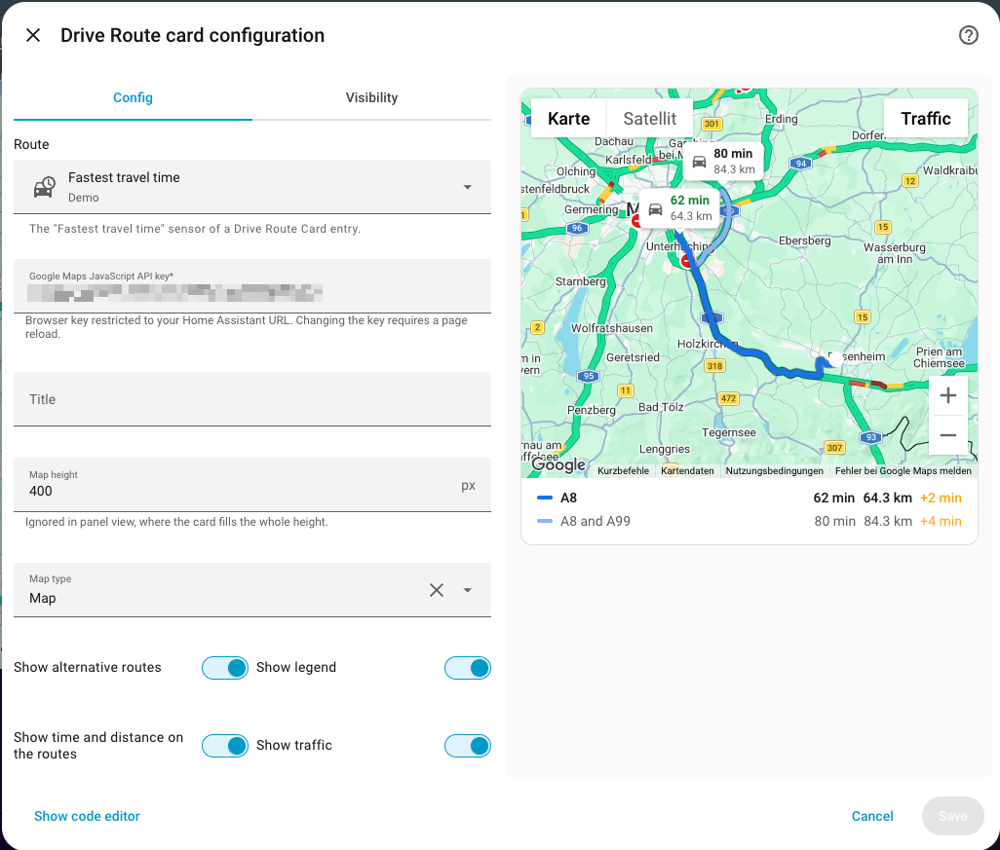

<p align="center">
  
</p>

# Drive Route Card

A Home Assistant integration that shows the current fastest route between two places together with up to two alternatives, like Google Maps does.

- **Sensors** for the travel time, traffic delay and distance of each route, plus *fastest* and *slowest travel time* sensors for dashboard badges and automations.
- **A map card** that draws all routes on a Google map, with travel time and distance on each route, live traffic, satellite view and custom map styles. The card is bundled with the integration, so you don't need to add a dashboard resource.
- Origin and destination can be **zones, persons or device trackers**, so a route can follow your current position.
- **Cost control**: configurable update interval and an optional time window, e.g. only on weekdays 06:00–09:00.

<p align="center">
  
</p>

Routes are calculated with the [Google Routes API](https://developers.google.com/maps/documentation/routes). More providers (HERE, TomTom, OSRM) are planned.

> **Status:** early development (0.x). Configuration and entities may still change. See the [changelog](CHANGELOG.md).

## Requirements

- Home Assistant 2025.8 or newer
- A Google Cloud project with billing enabled (see [Google API keys and costs](#google-api-keys-and-costs))

## Installation

### HACS (custom repository)

1. In HACS, open *⋮ → Custom repositories*.
2. Add `https://github.com/scheibome/drive-route-card` with type **Integration** (not *Dashboard*; the card comes with the integration).
3. Search for **Drive Route Card**, download it and restart Home Assistant.

### Manual

Copy `custom_components/drive_route_card` into your `config/custom_components` folder and restart Home Assistant.

## Google API keys and costs

You need **two API keys** from the [Google Cloud console](https://console.cloud.google.com/google/maps-apis/credentials):

| Key | API to enable | Restriction | Used by |
|---|---|---|---|
| Server key | Routes API | none, or your Home Assistant host's IP address | the integration |
| Browser key | Maps JavaScript API | *Website restrictions*: every URL you open Home Assistant with, e.g. `http://homeassistant.local:8123/*` and your external or Nabu Casa URL | the card |

Google bills every route query and every map load beyond a monthly free quota. Traffic-aware queries with alternatives are in a higher pricing tier, so check the current [pricing](https://developers.google.com/maps/billing-and-pricing/pricing) and set a budget alert.

As a rule of thumb, polling every 10 minutes around the clock costs about **4,300 queries per route per month**. With a time window of weekdays 06:00–09:00 it's about 400. The traffic layer on the map costs nothing extra.

## Setting up a route

*Settings → Devices & services → Add integration → Drive Route Card*

| Field | Description |
|---|---|
| Name | Name of the route, e.g. "Commute". Used as device name and in the entity names. |
| Google Maps API key | The server key |
| Origin / Destination | A `zone`, `person` or `device_tracker`. Persons and trackers follow their current position. |
| Travel mode | Car, motorcycle/scooter, bicycle or walking. Live traffic only applies to car and motorcycle. |
| Avoid tolls / Avoid highways | Only applies to car and motorcycle |



The API key is tested with a first query when origin and destination have a position. Add one entry per origin/destination pair. If Google later rejects the key, Home Assistant asks you for a new one.

### Options

Under **Configure** on the route's entry:

| Option | Default | Description |
|---|---|---|
| Travel mode, avoid tolls/highways | as set up | Same as above |
| Update interval | 10 min | 5 to 240 minutes |
| Only update within a time window | off | Only query between a start and end time on selected weekdays. Outside the window the sensors keep the last result. |
| Window start / end | 06:00 / 09:00 | The window may span midnight, e.g. 22:00 to 02:00. |
| Weekdays | Monday to Friday | Days on which the window applies |

## Entities

Each route is a device named after the route. Its entities are named after the device, so searching for the route name or "travel time" finds them. In German they are called *Schnellste Fahrzeit*, *Route 1 Fahrzeit* and so on.



| Entity | Description |
|---|---|
| Fastest travel time | Shortest duration of all routes |
| Slowest travel time | Longest duration of all routes |
| Route 1–3 travel time | Duration per route. Route 1 is Google's main route. |
| Route 1–3 traffic delay | Duration with traffic minus duration without traffic |
| Route 1–3 distance | Distance per route |

Durations are shown in minutes and distances in kilometers; you can change the unit in the entity settings. If Google returns fewer than three routes, the extra sensors become *unknown*.

The entity names follow the **server language** (*Settings → System → General*), not the language of your user profile. After changing the server language, restart Home Assistant to rename them.

The entity ID is created once from the name and the server language, e.g. `sensor.commute_fastest_travel_time`, and is not renamed later. You can look it up on the device page.

> The entity *Drive Route Card Update* with the state *Up-to-date* belongs to HACS and only shows whether a new version is available.

### Attributes

All duration and distance sensors have:

| Attribute | Description |
|---|---|
| `route` | Number of the route the value belongs to (1–3) |
| `description` | Google's short route name, e.g. "A9", if available |
| `last_query` | Time of the last successful query |

The *Fastest travel time* sensor also has `travel_mode`, `origin_entity`, `destination_entity`, `origin`, `destination` (coordinates) and `routes`, with duration, delay, distance, description and polyline for each route. The card uses these to draw the map. `routes`, `origin` and `destination` change with every query and are not stored in the recorder history.

### Badge

1. Edit the dashboard and add a badge of type **Entity**.
2. Search for the route name or "travel time" and pick *Fastest travel time* or *Slowest travel time*.
3. Choose under *Displayed elements* whether name, icon and state are shown.



### Action `drive_route_card.refresh`

Queries immediately, even outside the time window. Without parameters all routes are refreshed. Pass `config_entry_id` to refresh only one route, for example right before you leave:

```yaml
action: drive_route_card.refresh
data:
  config_entry_id: 01J...   # pick the route in the action editor
```

## Card

Add the card from the dashboard's card picker (*Drive Route Card*) and set it up in the visual editor. Until a browser key is entered, the card shows a sketch of the routes instead of the map; the card picker preview shows the same sketch.

The route picker only lists the *Fastest travel time* sensors of this integration, because they carry the map data.



### Options

| Option | Default | Description |
|---|---|---|
| `entity` | — | The route's *Fastest travel time* sensor (required) |
| `api_key` | — | Browser key for the Maps JavaScript API (required for the map). Changing it requires a page reload. |
| `title` | none | Card title |
| `height` | `400` | Map height in pixels. Ignored in a panel view. |
| `show_alternatives` | `true` | Draw the alternative routes |
| `show_legend` | `true` | List of routes with time, distance and delay below the map |
| `show_labels` | `true` | Time and distance on each route, like in Google Maps |
| `fastest_color` | `#1a73e8` | Color of the fastest route, any CSS color |
| `alternative_color` | `#8ab4f8` | Color of the alternative routes, any CSS color |
| `map_type` | `roadmap` | Initial map type: `roadmap`, `satellite`, `hybrid` (satellite with labels) or `terrain` |
| `show_traffic` | `false` | Show Google's live traffic layer initially |
| `show_controls` | `true` | Map type switch and traffic button on the map. Changes made there are not saved. |
| `map_style` | none | Google's JSON map styling, see below |
| `map_id` | none | Map ID for Google's cloud-based styling. Overrides `map_style`. |

Minimal YAML:

```yaml
type: custom:drive-route-card
entity: sensor.commute_fastest_travel_time
api_key: YOUR_BROWSER_KEY
```

### How routes are shown

- The fastest route is drawn on top in `fastest_color`, the alternatives in `alternative_color`. The legend highlights the fastest route as well.
- Each route's label shows its travel time and distance. The fastest time is green; routes delayed by at least 5 minutes by traffic are red. Labels sit where the routes differ, so they don't overlap.
- The map fits all routes into view and refits when the card is resized.

### Map styling

`map_style` takes Google's [JSON styling](https://developers.google.com/maps/documentation/javascript/style-reference): a list of rules with `featureType`, `elementType` and `stylers`. In the visual editor you can paste the JSON as is, for example from Google's styling wizard or snazzymaps.com. In YAML you can write it as a list:

```yaml
map_style:
  - elementType: geometry
    stylers:
      - color: "#242f3e"
  - featureType: water
    elementType: geometry
    stylers:
      - color: "#17263c"
```

Alternatively, create a style in the Google Cloud console and set its `map_id`. When a map ID is set, Google ignores `map_style`. An invalid style is shown as a message in the card.

### Panel view

In a dashboard view with the **Panel** layout, the card fills the whole height and `height` is ignored. The map then takes scroll and drag gestures directly. In other views you hold Ctrl (or use two fingers) to zoom, so the page still scrolls. While the dashboard is edited, the card leaves room for Home Assistant's edit buttons.

## Troubleshooting

### The map stays grey or shows "Oops! Something went wrong"

Google rejected the browser key, and the card shows a message saying so. The exact reason is in the browser console (F12 → *Console*):

| Error | Cause | Fix |
|---|---|---|
| `ApiNotActivatedMapError` | Maps JavaScript API not enabled | Enable it in the Cloud console |
| `RefererNotAllowedMapError` | The key's website restriction doesn't match your Home Assistant URL | Add every URL you use, ending with `/*` |
| `InvalidKeyMapError` | Wrong key, often the server key | Use the browser key |
| `BillingNotEnabledMapError` | No billing account | Link a billing account to the project |
| `ApiTargetBlockedMapError` | The key's API restriction excludes the Maps JavaScript API | Allow the Maps JavaScript API for the key |

### Fewer routes than in Google Maps

The Routes API decides how many alternatives it returns, and it often returns fewer or different routes than the Google Maps app. *Avoid highways* or *Avoid tolls* also remove routes. To see how many routes Google returned, enable debug logging:

```yaml
logger:
  logs:
    custom_components.drive_route_card: debug
```

### Sensors are unavailable

The integration retries automatically. Common causes:

- A person or device tracker has no position (e.g. GPS turned off). The log names the entity.
- Google rejected the server key. The entry then shows *Reconfigure* under *Settings → Devices & services*, where you enter a new key.

### The card doesn't change after an update

Restart Home Assistant after updating, then reload the browser page. In the Companion app, clear the frontend cache in the app's settings.

## Development

The repository contains two parts:

- `custom_components/drive_route_card/`: the integration (Python)
- `frontend/`: the source of the card (TypeScript + Lit). Its build output is committed to `custom_components/drive_route_card/www/` and served by the integration.

### Integration

Requires Python 3.14.

```bash
python3.14 -m venv .venv && source .venv/bin/activate
pip install -r requirements_test.txt
pytest
ruff check . && ruff format --check .
```

### Card

Requires Node.js 24 or newer.

```bash
cd frontend
npm ci
npm run typecheck
npm test
npm run build   # or: npm run watch
```

Commit the rebuilt `www/drive-route-card.js` together with your source changes. CI fails if the bundle is out of date.

### Releases

Bump `version` in `custom_components/drive_route_card/manifest.json` and `frontend/package.json` together, rebuild the card, and move the `[Unreleased]` entries in [CHANGELOG.md](CHANGELOG.md) to a new version section. The manifest version is also used to bust the browser cache for the card.

### Adding a routing provider

Implement `RouteProvider` from `providers/base.py` and return routes with polylines in Google's encoded polyline format. The sensors work unchanged; the card currently renders on Google Maps only.

## License

[MIT](LICENSE)
